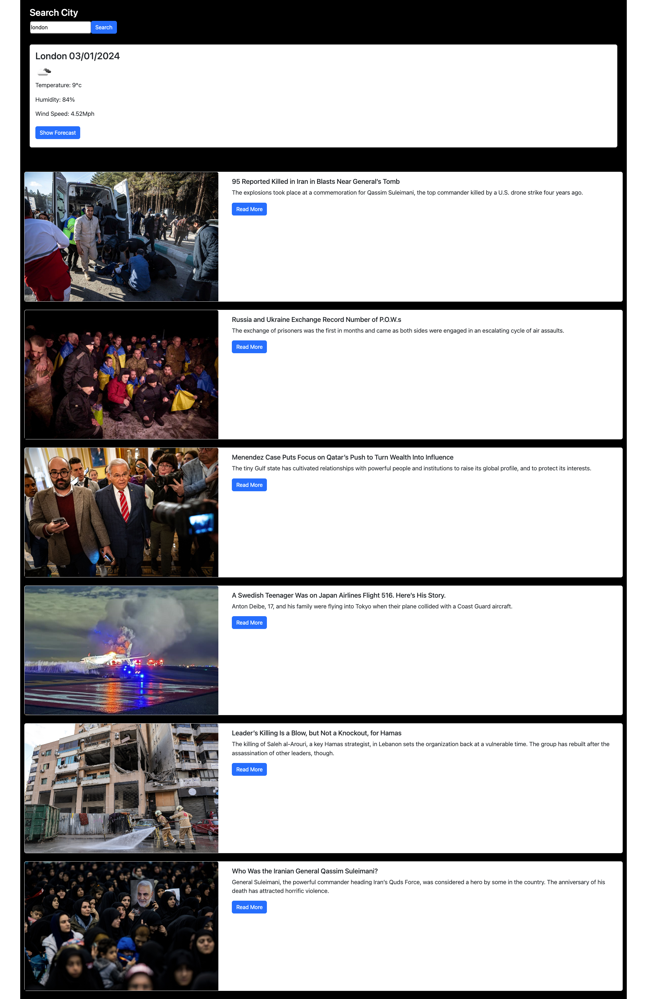

# MJ-news-and-weather

## Description
In this challenge, I have created the application that provide current weather, forecast and World news. The idea was to find desired city's weather and the city's News. However, NYtimes API did not provide whole cities news aticles. Therefore, I changed it to the World news.
Weather forecast can be viewd in the modal.

[Link to the Web page]( https://salala1005.github.io/MJ-news-and-weather/)

[Link to the Github](https://github.com/Salala1005/MJ-news-and-weather)

[Link to the presentation](https://docs.google.com/presentation/d/1EN7olgR1qe_iwaugXHd3vXyNoVD-LpOjQAbnxVAiyNQ/edit#slide=id.g29f43f0a72_0_24)